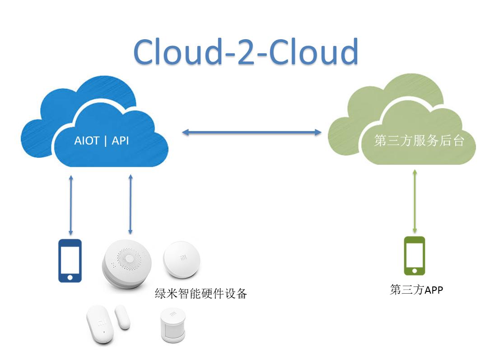

# 绿米AIOT云端开发手册

绿米深耕智能家居行业多年，旗下拥有多种智能家居硬件产品，为用户打造智能家庭应用场景下的一系列硬件、软件、产品和服务。近年来随着智能家居行业的迅猛发展，我们需要能够灵活地融入到整个市场，寻求更多的行业解决方案，为越来越多的用户带来优质的完善的智能化家居生活服务。开放、互联互通势必是智能家居行业未来发展的趋势和繁荣的基础，这是由业务场景和产品形态所决定的。因此，“开放”贯穿绿米整个产品线。AIOT作为绿米的云后台，为各种智能硬件提供联网、控制、管理等服务，为用户提供各种应用（如联动、场景等），同时也将各种业务能力开放出去，让合作商能够更便捷地使用绿米智能硬件产品，也能够更便捷地管理和控制它们，从而更高效地为用户提供服务。

AIOT云对外提供灵活的开放服务，我们开放云端接口供第三方的APP使用，方便第三方APP直接控制绿米的智能硬件产品，同时也能够实时获取智能硬件的属性状态；为了能够为第三方提供更完善的服务，AIOT也开放云对云的接口。

# 绿米AIOT云对云接口（Cloud-2-Cloud）

AIOT为云对云提供了非常完善的接口，包括有:

* 账号对接
* 设备管理
* 资源管理
* 固件升级
* 消息订阅和推送

使用这些接口，只需要在AIOT开放平台注册帐号，并创建应用，获得AppId和AppKey，便被授权使用这些API。

【说明：如有需要合作，请与我们取得联系，谢谢】

下面，会根据业务开发流程，介绍各个开放接口。为保证安全，这些API均使用Https协议，接口调用使用基本的GET、POST方法，参数传递推荐使用JSON格式，接口返回结果均是JSON格式。

接口域名为：[https:\/\/aiot-rpc-3rd.aqara.cn](https://aiot-rpc-3rd.aqara.cn)

AIOT开放平台（开发中）： [https:\/\/opencloud.aqara.cn\/login](https://opencloud.aqara.cn/login)

当前版本：0.30

