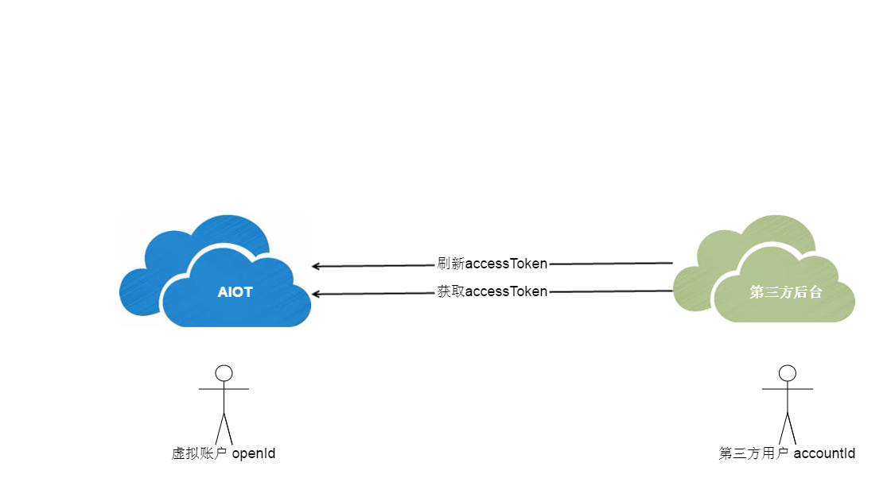

# 账户对接 \(暂未开放\)

Cloud-2-Cloud开放方案中用户的账户信息是属于第三方的，AIOT主要提供设备管理相关能力，但AIOT需要为这些智能设备绑定到指定的用户上，并为该用户授予权限，允许该用户可以查看设备状态和控制设备等。那么就需要AIOT为第三方用户创建一个虚拟账户，要实现这样的账户对接，我们需要第三方应用在有新用户注册的时候，立即向AIOT发送请求，来获取该用户使用AIOT的权限（accessToken），参照OAuth2.0协议，AIOT会为该账户创建一个accessToken和refreshToken，accessToken作为该用户的授权，但它的有效期比较短，一般为1天时间；如果过期了，可以利用refreshToken来刷新，重新获得accessToken和refreshToken，而refreshToken的有效期一般为一个月。

用户的账户信息均存放在第三方后台，AIOT并不索取这些用户的信息，只是需要创建一个虚拟账号，并授权访问AIOT的业务接口。在此，我们提供两个API：

* 获取accessToken
* 刷新accessToken

通过这两个API，便可以方便地实现账户的对接。

---

## 获取accessToken

| **API** | /open/account/access/get |
| ---: | :--- |
| **描述** | 用户获取接入权限 |
| **header** | {"**Appid**":"xxx","**Appkey**":"xxx"} |
| **payload** | {"accountId":"xxx"} |
| **response** | {"code":0\(errorCode\), "result":{"openId":"xxx","accessToken":"xxx","expires\_in":xxx,"refreshToken":"xxx"} |

> * payload: Https请求的payload，默认使用JSON格式
> * header: Https请求的header
> * accountId: 第三方应用用户的id
> * Appid: 第三方应用appId
> * Appkey: 第三方应用appKey
> * openId: 为第三方应用创建的虚拟对接账号
> * accessToken: 授权访问的token
> * expires\_in: accessToken的有效期，单位为秒
> * refreshToken: 用于刷新accessToken
> * errorCode: 返回错误码，0表示成功

## 刷新accessToken

| **API** | /open/account/access/refresh |
| ---: | :--- |
| **描述** | 刷新权限 |
| **header** | {"**Appid**":"xxx","**Appkey**":"xxx"} |
| **payload** | {"openId":"xxx","refreshToken":"xxx"} |
| **response** | {"code":0\(errorCode\), "result":{"openId":"xxx","accessToken":"xxx","expires\_in":xxx,"refreshToken":"xxx"} |

当accessToken过期时，利用refreshToken和这个API，可以重新获取一对新的accessToken和refreshToken。

说明：此账户对接方式尚未开放，推荐使用OAuth2.0的方式

