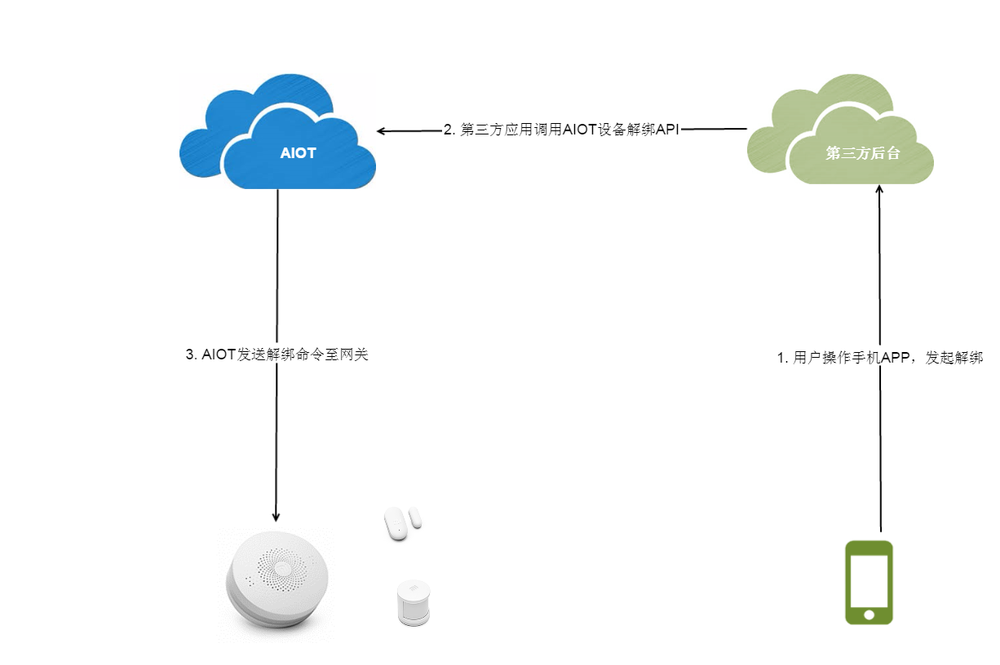
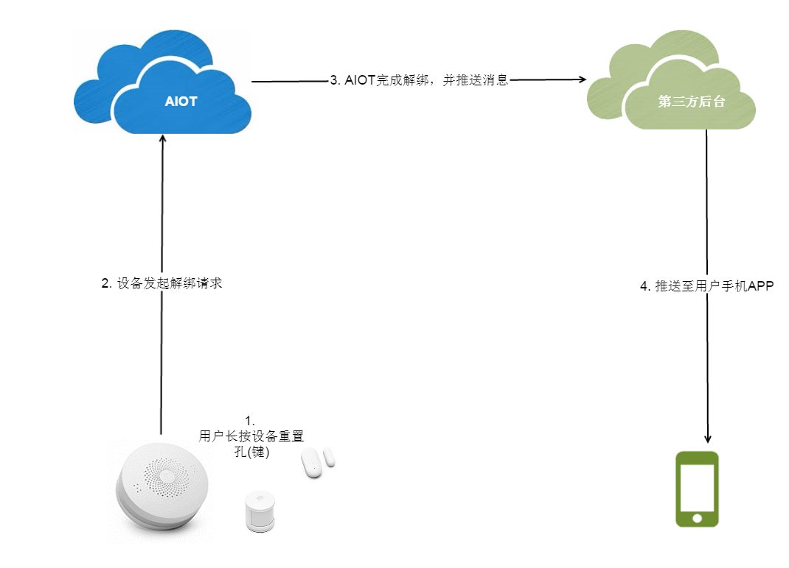

#设备解绑
用户也可以解绑设备，解绑的方式对于网关类设备和子设备没什么差别，但都具有两种方式：

- 由手机APP发起设备解绑
- 设备自身触发解绑（长按重置键）

这里需要注意的是如果用户解绑网关类设备，那么该网关类设备下的子设备均一同被解绑；如果用户解绑子设备，只是解绑该子设备与用户的绑定关系，不影响其他设备。

---

##手机APP发起设备解绑

手机APP发起设备解绑的流程如下：

1. 用户在手机APP上操作设备解绑
2. 解绑命令由AIOT发送至网关
3. 网关收到解绑消息，如果是子设备解绑就将子设备的信息删除，如果是网关解绑，就将网关保存的用户id删除掉，并同时开启可入网模式

| **API** | /open/device/unbind/gateway |
| --: | :-- |
| **描述** | 网关类设备解绑 |
| **header** | {"**Appid**":"xxx","**Appkey**":"xxx","Openid":"xxx","**Access-Token**":"xxx"} |
| **payload** | {"openId":"xxx","**did**":"xxx"} |
| **response** | {"code":0(errorcode), "result":"msg"}} |

| **API** | /open/device/unbind/subdevice |
| --: | :-- |
| **描述** | 子设备解绑 |
| **header** | {"**Appid**":"xxx","**Appkey**":"xxx","Openid":"xxx","**Access-Token**":"xxx"} |
| **payload** | {"openId":"xxx","**did**":"xxx"} |
| **response** | {"code":0(errorcode), "result":"msg"}} |

---

##设备发起解绑

用户可以长按设备的重置孔进行解绑，这种方式的解绑流程如下：

- 用户长按设备的重置孔
- 设备向AIOT发起解绑的请求
- AIOT完成设备与用户的解绑，并将消息推送至第三方应用后台
- 第三方应用后台将消息推送至用户手机APP

需要第三方应用后台提供接收消息的接口，这里定义消息内容格式：

| msgType | device_unbind |
| --: | :-- |
| **描述** | 解绑消息推送 |
| **header** | {"**Appid**":"xxx","**Appkey**":"xxx"} |
| **payload** | {"**msgType**":"device_unbind","**did**":"xxx","**result**":0/1} |

> - did: 设备id
> - msgType: 消息类型
> - result: 解绑结果,0-失败,1-成功
> - Appid: 第三方应用的appId
> - Appkey: 第三方应用的appKey