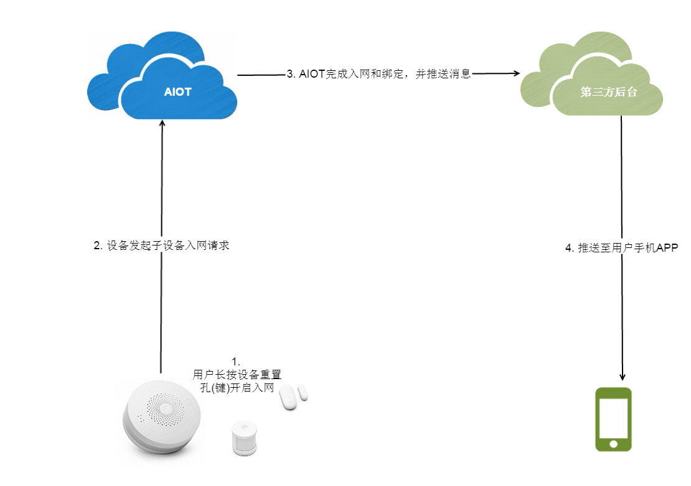
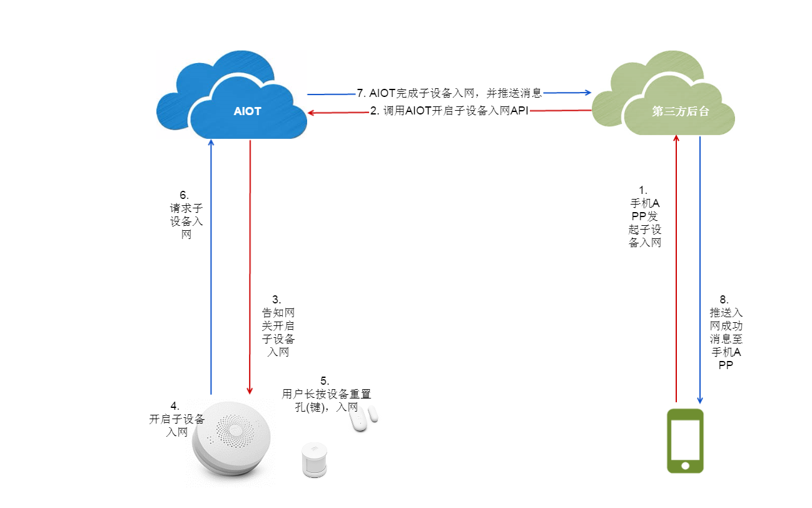

# 设备入网

用户拿到智能设备之后，首先需要将智能设备入网，就是通过家里的WiFi网络，接入AIOT，然后才能够对该智能设备进行管理和控制。绿米的智能硬件设备主要分为两大类：网关类设备和子设备，其中网关类设备（例如网关、空调伴侣、摄像头等具备网关功能的设备）具备WiFi芯片，可以直接接入互联网；子设备（例如人体传感器、智能插座、墙壁开关等）通过Zigbee接入网关，由网关来管理这些子设备。这两类设备的入网有所区别。

##网关类设备入网

网关类设备上电之后，需要通过手机APP协助网关接入wifi，这一步又被称为“快连”，然后接入AIOT，把设备基本信息上报，完成入网。主要过程是：

1. 手机接入网关AP（即网关提供的AP网络），手机APP将当前家里WiFi的ssid、密码和用户id发送给网关；
2. 网关断开AP，连上WiFi；
3. 网关接入AIOT，并将网关设备的信息和用户id发送给AIOT，完成入网和绑定；
4. AIOT推送设备基本信息给第三方服务后台；
5. 第三方后台将设备信息推送至用户手机APP。

我们会提供设备入网SDK，方便第三方应用嵌入到APP中，需要第三方应用做的有两件事:
- 第三方APP将用户id(即openId，来自账户对接获取的openId)发送给网关，网关携带此openId入网，完成与此用户的绑定；
- 第三方云后台提供订阅接口，AIOT完成设备入网和绑定之后，将消息推送到第三方云平台接口，然后第三方云平台便可以将设备信息推送至手机APP。

需要第三方应用后台提供接收消息的接口，这里定义消息内容格式：

| msgType | device_join |
| --: | :-- |
| **描述** | 设备入网消息推送 |
| **header** | {"**Appid**":"xxx","**Appkey**":"xxx"} |
| **payload** | {"**msgType**":"device_join","**did**":"xxx","**result**":{"did":"value", "model":"value", "name":"xxx","firmwareVersion":"value","chipVersion":"value"}} |

> - did: 设备id
> - msgType: 消息类型
> - model: 设备类型
> - firmwareVersion: 设备固件版本
> - chipVersion: 设备芯片版本
> - Appid: 第三方应用的appId
> - Appkey: 第三方应用的appKey

##子设备入网

子设备不具备接入WiFi的能力，需要通过网关来对它们进行管理和控制。子设备的入网可以有两种方式：
- 不借助手机APP，通过网关按键（比如按三下）开启子设备入网，然后长按子设备按键（或重置孔）完成入网；
- 借助手机APP，用户在手机APP上开启子设备入网，这时需要将开启入网的请求发送至网关，网关开启子设备入网，然后长按子设备按键（或重置孔）完成入网。

在入网过程中，网关会将用户id(openId)和子设备信息发送至AIOT，AIOT完成子设备入网和绑定。AIOT将设备信息发送至第三方应用后台，第三方后台再推送至用户手机APP。

###设备触发入网

不借助手机APP，用户可以入网子设备，流程如下：

1. 用户按键网关（比如按三下）开启子设备入网，然后长按子设备按键（或重置孔）
2. 网关向AIOT发起子设备入网请求
3. AIOT完成子设备入网和绑定，并将消息推送至第三方应用后台
4. 第三方应用后台推送消息至用户手机APP

需要第三方应用后台提供接收消息的接口，这里定义消息内容格式：

| msgType | device_join |
| --: | :-- |
| **描述** | 设备入网消息推送 |
| **header** | {"**Appid**":"xxx","**Appkey**":"xxx"} |
| **payload** | {"**msgType**":"device_join","**did**":"xxx","**result**":{"did":"value", "model":"value", "name":"xxx","firmwareVersion":"value","chipVersion":"value"}} |

> - did: 设备id
> - msgType: 消息类型
> - model: 设备类型
> - firmwareVersion: 设备固件版本
> - chipVersion: 设备芯片版本
> - Appid: 第三方应用的appId
> - Appkey: 第三方应用的appKey

###手机APP触发入网

用户借助手机APP开启子设备入网，流程如下：

1. 用户在手机APP上开启子设备入网
2. 第三方应用调用AIOT的子设备入网API
3. AIOT将开启子设备入网的消息发送至网关
4. 网关开启子设备入网
5. 长按子设备重置孔(键)，网关捕捉到子设备入网
6. 网关向AIOT请求子设备入网
7. AIOT完成子设备入网和绑定，并将消息推送至第三方应用后台
8. 第三方应用后台推送消息至用户手机APP

AIOT开放开启子设备入网API，如下：

| **API** | /open/device/connect/subdevice/start |
| --: | :-- |
| **描述** | 开启子设备入网 |
| **header** | {"**Appid**":"xxx","**Appkey**":"xxx","Openid":"xxx","**Access-Token**":"xxx"} |
| **payload** | {"openId":"xxx","**did**":"xxx"(网关类设备id)} |
| **response** | {"code":0(errorcode), "result":"msg"}} |

在子设备入网成功后，AIOT将子设备信息和入网成功消息推送至第三方应用后台，需要第三方应用后台提供接收消息的接口，消息内容格式如下：

| msgType | device_join |
| --: | :-- |
| **描述** | 设备入网消息推送 |
| **header** | {"**Appid**":"xxx","**Appkey**":"xxx"} |
| **payload** | {"**msgType**":"device_join","**did**":"xxx","**result**":{"did":"value", "model":"value", "name":"xxx","firmwareVersion":"value","chipVersion":"value"}} |

> - did: 设备id
> - msgType: 消息类型
> - model: 设备类型
> - firmwareVersion: 设备固件版本
> - chipVersion: 设备芯片版本
> - Appid: 第三方应用的appId
> - Appkey: 第三方应用的appKey